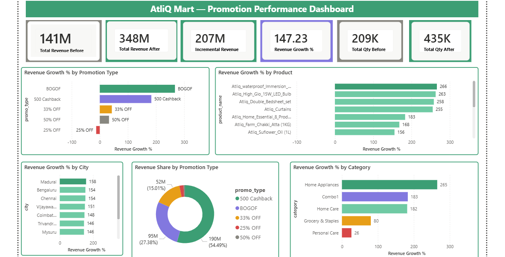
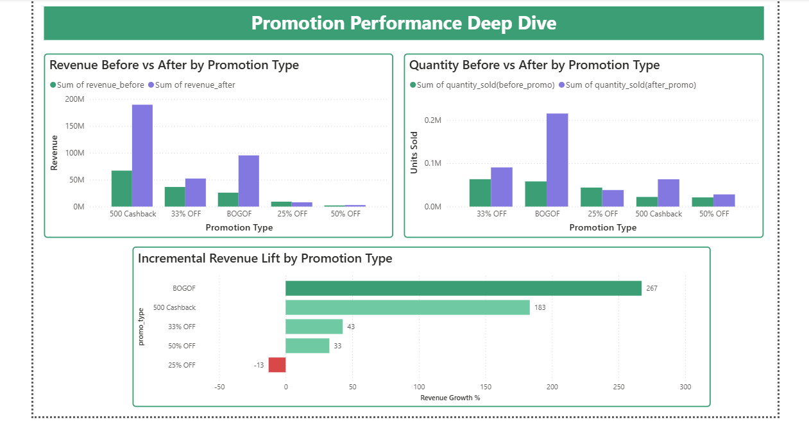
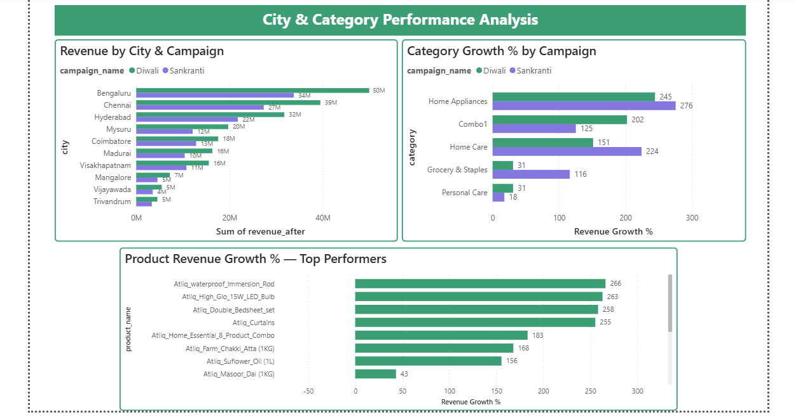
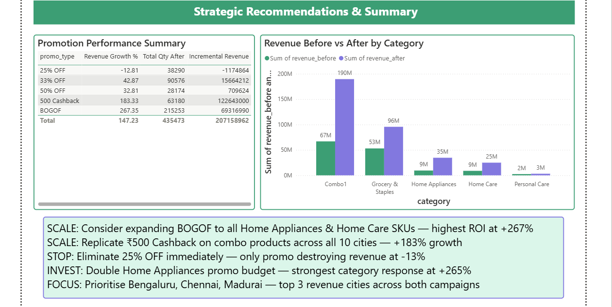

# AtliQ Mart — Retail Promotion Analytics Dashboard

### Tools

Python · Pandas · Power BI · DAX · CSV

### Domain

FMCG Retail · Promotional Analytics · Revenue Optimization

### Scope

50+ Stores · South India · Diwali 2023 & Sankranti 2024

---

# Business Problem

AtliQ Mart's Sales Director needed to understand which promotional campaigns were driving revenue — and which were quietly destroying it.

With two major campaigns across 50+ stores and 1,500+ promotional events, business decisions were being made without clear analytical backing.

This project answers four core business questions:

* Which promotion types generated the highest revenue lift?
* Which product categories responded best to promotions?
* Which cities outperformed — and which underperformed?
* Where should future promotional budgets be focused?

---

# Key Findings

| Metric                          | Result                  |
| ------------------------------- | ----------------------- |
| Total Revenue Before Promotions | ₹14.1 Cr                |
| Total Revenue After Promotions  | ₹34.8 Cr                |
| Overall Revenue Growth          | +147%                   |
| Best Performing Promotion       | BOGOF (+267%)           |
| Worst Performing Promotion      | 25% OFF (−13%)          |
| Top Category                    | Home Appliances (+265%) |
| Top City                        | Madurai (+158%)         |

> Critical Insight:
> 25% OFF was the only promotion actively reducing revenue performance.

---

# Dashboard Structure

## Page 1 — Executive Overview

* KPI cards
* Promotion performance analysis
* City rankings
* Category performance
* Revenue share visualization

## Page 2 — Promotion Deep Dive

* Revenue before vs after promotions
* Quantity uplift analysis
* Incremental revenue comparison
* Promotion effectiveness breakdown

## Page 3 — City & Category Analysis

* Diwali vs Sankranti comparison
* Category growth by campaign
* Product performance analysis
* Regional revenue growth trends

## Page 4 — Strategic Insights

* Promotion summary table
* Category-wise performance comparison
* Business recommendations panel

---

# Strategic Recommendations

* SCALE — Expand BOGOF promotions across high-performing Home Appliances and Home Care categories
* SCALE — Replicate ₹500 Cashback strategy for combo products across additional cities
* STOP — Eliminate 25% OFF campaigns due to negative revenue impact
* INVEST — Increase Home Appliances promotional budget due to highest category response
* FOCUS — Prioritize Bengaluru, Chennai, and Madurai for future campaign investment

---

# Project Workflow

```text
Raw CSV Files
        ↓
Python (Pandas + Feature Engineering)
        ↓
Analytical Dataset
        ↓
Power BI Dashboard
```

### Feature Engineering Included

* Revenue Before / After Promotion
* Revenue Growth %
* Quantity Growth %
* Incremental Revenue
* Campaign-level Segmentation

---

# Dataset Overview

| Table         | Description                          |
| ------------- | ------------------------------------ |
| fact_events   | Transactional promotional sales data |
| dim_products  | Product details and categories       |
| dim_stores    | Store IDs and city information       |
| dim_campaigns | Campaign names and durations         |

---

# DAX Measures

```DAX
Revenue Growth % =
DIVIDE(
    [Total Revenue After] - [Total Revenue Before],
    [Total Revenue Before]
) * 100

Incremental Revenue =
[Total Revenue After] - [Total Revenue Before]
```

---

# Repository Structure

```text
AtliQ-Promo-Analysis/
├── data/                # Raw CSV datasets
├── notebooks/           # Python EDA notebook
├── dashboard/           # Power BI .pbix dashboard
├── screenshots/         # Dashboard screenshots
└── README.md
```

---

# Dashboard Screenshots

# Dashboard Screenshots

## Executive Overview


## Promotion Analysis


## City & Category Analysis


## Strategic Insights


---

# Built By
